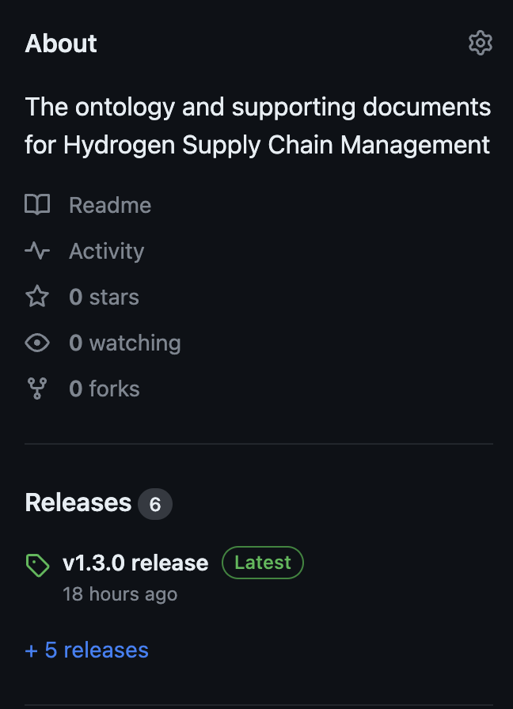
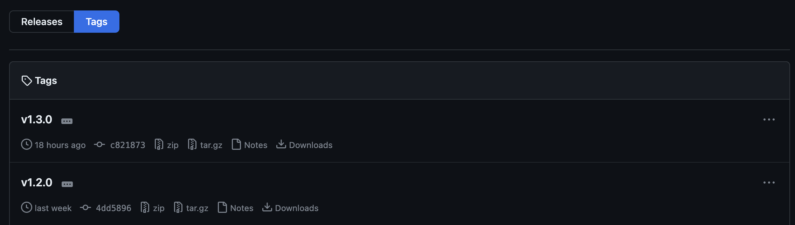
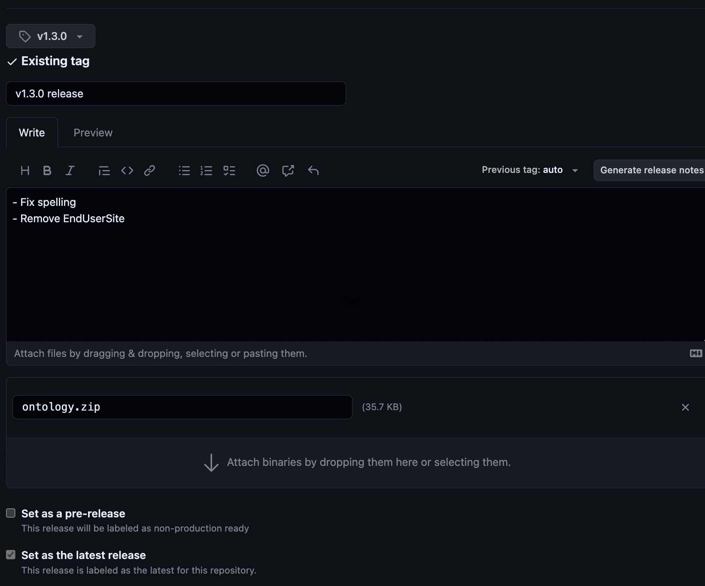

# Ontology

This is where the ontology concerning the management of the Hydrogen Non-road mobile machinery (NRMM) supply chain. The ontology follows the [OWL standard](https://www.w3.org/OWL/) and is defined using [LinkML](https://linkml.io/linkml/) in [YAML](https://yaml.org/).

## Namespace

The namespace that the ontology follows is `https://w3id.org/hydrologiq/hydrogen/nrmm` which is prefixed as `hydrogen_nrmm`.

## Making changes

1. All changes should be made on a branch and a PR created following the template
   - Branches should be appropriately named e.g. `relationship-changes`
   - All new YAML files must end with a new line see [known issue](#known-issues)
   - Commits should be made using gitmoji see the [development guide](https://coda.io/d/_d36dB83GZVM/Development_suNC1#_luVgb)
   - The commit will run a [GitHub action](https://github.com/hydrologiq/h2scm-ontology/actions/workflows/bundle.yaml) which will run the build script, if this fails the PR cannot be merged. You can build this locally following the [Building locally](#building-locally) guide.
1. The PR does not need a reviewer but if you think it needs one please request it
1. Merge the PR
1. Delete the branch (can be done via UI or cli with `git branch -D <branch_name>`)

## Packaging

The ontology is currently packaged as a zip file and attached to a specific release. There are multiple files included within the zip file, the following types of files can be found:

- [LinkML YAML](https://linkml.io/) in which the ontology is declared using.
- [RDF](https://www.w3.org/RDF/) the file format which is the generated [OWL ontology](https://www.w3.org/OWL/).
- [Python] the generated Python classes used to interface with instances of data.
- [JSON](https://www.json.org/json-en.html) the generated [JSON Schema](https://json-schema.org/) which includes all the classes in the ontology.
- [JSON-LD](https://json-ld.org/) the generated JSON context which enables easier understanding of the JSON Schema and data structure.

Within the zip there are four different kinds of generated files, these are:

- `hydrogen_nrmm.*` - This is the un-altered ontology which is defined in this repository.
- `hydrogen_nrmm_inlined.*` - This is the ontology but with `inlined` and `inlined_as_list` set to `True`. This means that any relationships within the JSON Schema will be inlined as objects not as strings/IDs.
- `hydrogen_nrmm_relationships.json` - This is a custom json object in which the keys represent the relationship name and the values (array of strings) represent the names of classes which can be associated with that relationship.
- `hydrogen_nrmm_optional.*` - This is the ontology but with `required` set to `False`.

### Building locally

To run the [build.sh](./build.sh) script locally you need to install python using pyenv and the following pip requirements. You can do this by following the commands below at the root of the repository.

1. `brew install pyenv`
1. `eval "$(pyenv init -)"` (optional if already installed)
1. `pyenv install` (optional if already installed)
1. `pyenv exec python -m venv .venv` (optional if already installed)
1. `source .venv/bin/activate`
1. `pip3 install -r requirements.txt` (optional optional if already installed)
1. `./build.sh`

## Release process

1. Tag a commit with a version e.g. `git tag -a v1.3.0 -m "Tagging v1.3.0 release"`
1. Push that tag `git push origin v1.3.0`
1. Create a release within GitHub

   1. Navigate to this [repository]()
   1. On the right hand navigation click on the `Releases` section

   

   3. Once on releases click on `Tags`
   1. Once on tags click on the `...` menu for the tag you previously

   

   5. Click on `Create release`

   

   6. For the title just put the release version and the text release e.g. `v1.3.0 release`
   1. Then for the description put a bullet point list of what has changed
   1. For the attachment you need to upload the bundled version of the ontology, this needs to be the `ontology.zip` artifact of the bundle related to the commit you have tagged for this release
   1. Ensure that `Set as the latest release` is selected
   1. Click `Publish release` 🥳

### Post release

1. Ensure that any repositories which are using the ontology are updated to the latest release, currently this is done by updating the `pre-build.sh` script in every relevant repository.

## Instance details

- `id` -- `hydrogen_nrmm:<uuid4>`

## Known issues

- Specifying an array of objects produces a key error, meaning a URI or CURIE (the `id`) will need to be referenced. This means any objects will need to be created as instances of the class.
- Each YAML file must end with a new line, otherwise it causes the build script to fail.

## Migrations

Currently we have no automated way to provide data migrations for ontology changes, there is only the manual generation and running of [SPARQL Update](https://www.w3.org/TR/sparql11-update/) queries.

We currently have a selected list of [example migrations](#example-migrations) which can be used, please update the list if you have to create a new one (**this will be automated in the future**).

### Running a migration

Currently the only way to run a migration is to navigate to run the SPARQL Update query in the graph database.

### Example migrations

- [Updating an attribute name](#updating-an-attribute-name)

#### Updating an attribute name

Replace the following variables:

- `<old_name>` with the current name for the attribute you want to update. Example: quantity
- `<new_name>` with the new name for the attribute you want to update. Example: weeklyProductionCapacity
- `<types>` with a space separated list of the types you want to make this attribute update on. Example: hydrogen_nrmm:ElectrolyticHydrogen hydrogen_nrmm:SteamMethaneReformingHydrogen

Code:

`PREFIX rdf: <http://www.w3.org/1999/02/22-rdf-syntax-ns#>
PREFIX hydrogen_nrmm: <https://w3id.org/hydrologiq/hydrogen/nrmm>
DELETE { GRAPH ?graph { ?subject hydrogen_nrmm:<old_name> ?value } }
INSERT { GRAPH ?graph { ?subject hydrogen_nrmm:<new_name> ?value } }
WHERE  {
    GRAPH ?graph {
        VALUES ?types { <types> }
    ?subject rdf:type ?types ;
             hydrogen_nrmm:<old_name> ?value
    }
}`
